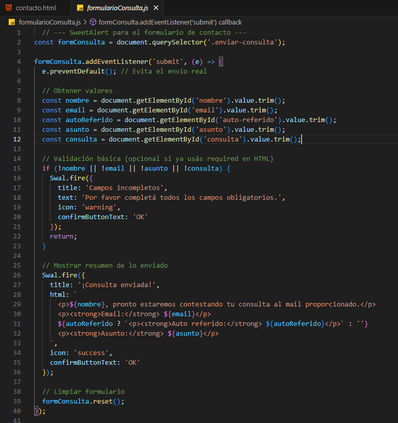
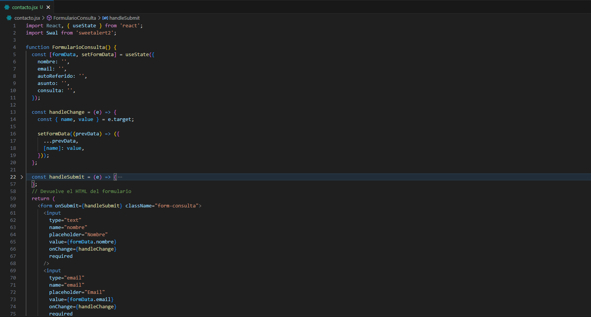

# Framework - React

## Descripción general

**React** es una biblioteca de JavaScript desarrollada por Meta (Facebook) para construir interfaces de usuario interactivas. Su principal propósito es facilitar el desarrollo de aplicaciones web de una sola página (SPA) a través de una arquitectura basada en componentes reutilizables.

### Características destacadas

- Virtual DOM para actualizaciones rápidas y eficientes.
- Enfoque declarativo para construir interfaces.
- Arquitectura basada en componentes.
- Amplia comunidad y ecosistema.
- Compatibilidad con bibliotecas externas (Redux, React Router, etc.).

## Motivación y justificación

React fue elegido por su flexibilidad y simplicidad en la creación de interfaces dinámicas. Su sintaxis JSX y el uso del Virtual DOM permiten un desarrollo más rápido y organizado. Además, cuenta con una comunidad muy activa y una gran cantidad de documentación, lo cual facilita la resolución de problemas.

Este framework es ideal para proyectos modernos con una interfaz rica en interactividad, como el actual, que requiere una experiencia fluida para el usuario.

## Nivel de dificultad de adaptación

La curva de aprendizaje de React es **moderada**, especialmente para quienes ya tienen conocimientos en JavaScript. Adaptarlo al proyecto actual implicaría:

- Comprender JSX y el manejo de estado (con hooks como `useState`, `useEffect`).
- Reestructurar la interfaz en componentes reutilizables.
- Posible incorporación de herramientas complementarias (React Router, gestión de estado).

En general, el esfuerzo es razonable y está bien justificado por los beneficios que ofrece.

## **Ejemplo de código - "Antes y después"**

- **JavaScript puro**:  
  

- **Con React**: