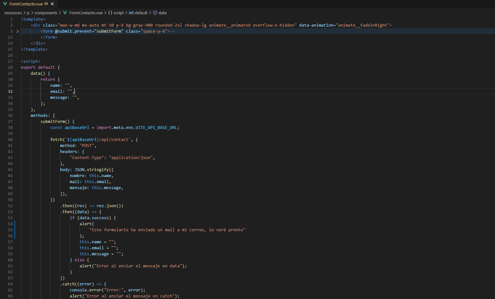

# Framework - Vue.js

## Descripción general

**Vue.js** es un framework progresivo de JavaScript para construir interfaces de usuario. Es especialmente conocido por su facilidad de uso, integración gradual y curva de aprendizaje amigable. Fue creado por Evan You y ha ganado popularidad por su simplicidad y flexibilidad.

### Características destacadas

- Sintaxis clara y accesible.
- Componentes reactivos y reutilizables.
- Integración fácil con proyectos existentes.
- Sistema de plantillas basado en HTML.
- Herramientas oficiales como Vue Router y Vuex.

## Motivación y justificación

Vue fue elegido por su baja barrera de entrada y su enfoque progresivo, lo que permite introducirlo gradualmente en proyectos existentes. Es ideal para equipos pequeños o desarrolladores que buscan rapidez en la implementación sin perder control sobre la estructura del proyecto.

Para el proyecto actual, Vue permite una creación eficiente de componentes interactivos, con una sintaxis intuitiva y soporte para herramientas modernas.

## Nivel de dificultad de adaptación

Vue tiene una **curva de aprendizaje baja**, especialmente para quienes están familiarizados con HTML, CSS y JavaScript.

Incorporarlo al proyecto implicaría:

- Aprender su sistema de plantillas y directivas (`v-for`, `v-if`, etc.).
- Reorganizar la interfaz en componentes Vue (`.vue`).
- Utilizar Vue CLI o Vite para configurar el entorno.

En resumen, Vue es muy accesible y se adapta fácilmente a proyectos nuevos o existentes.

## **Ejemplo de código - "Antes y después"**

- **Componente con Vue de un poryecto propio**:

- **JavaScript puro**:
